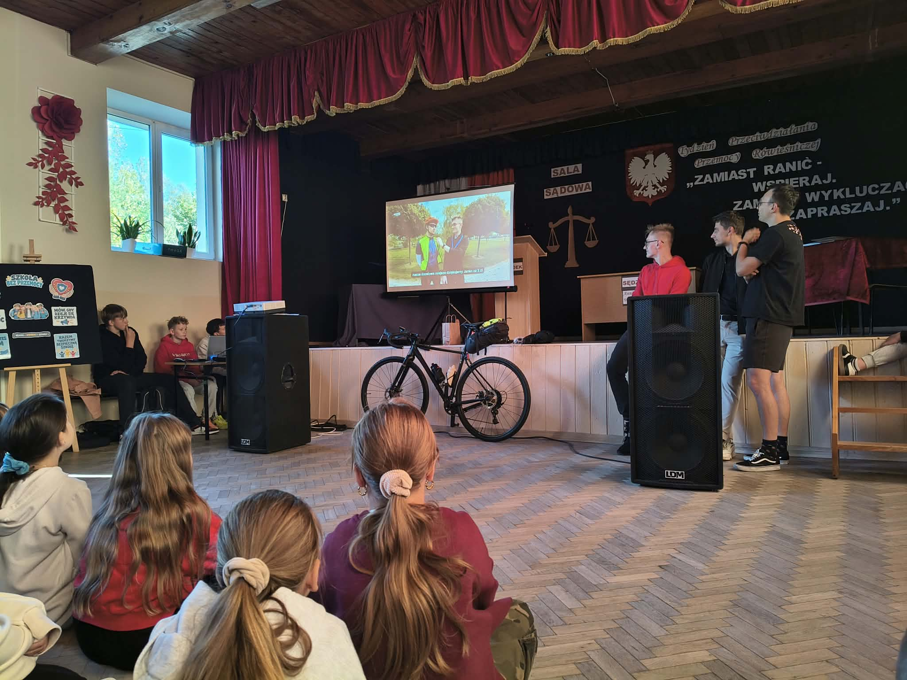
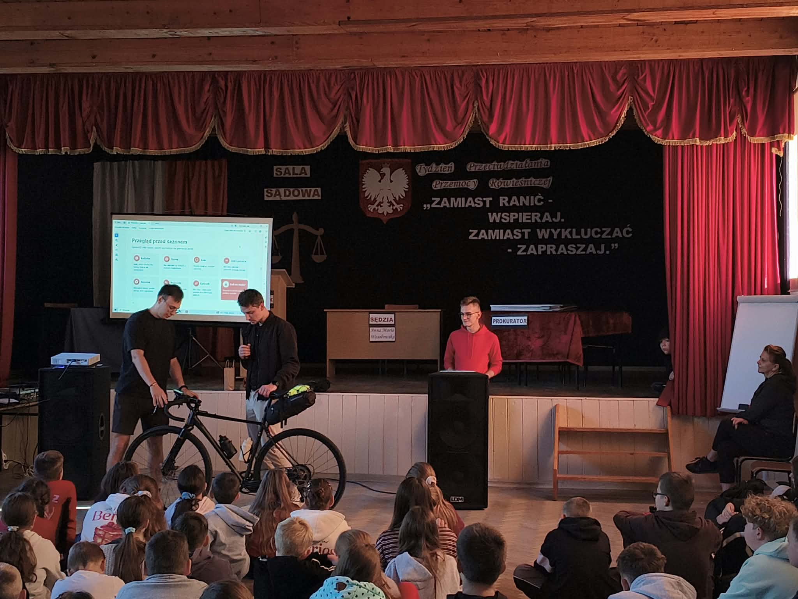
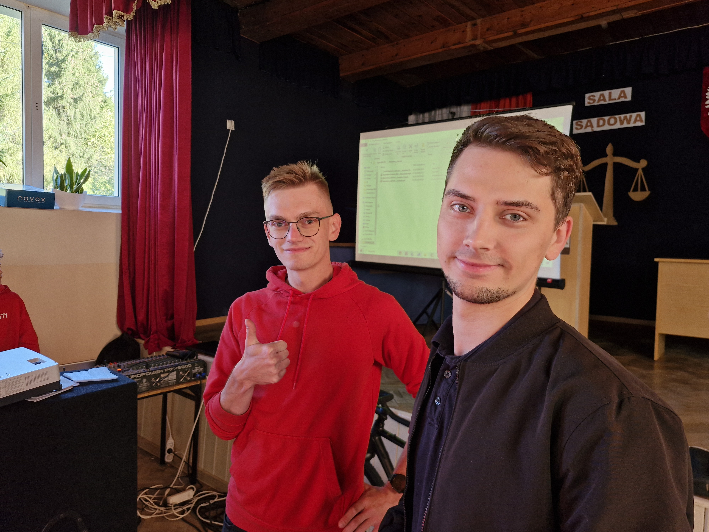
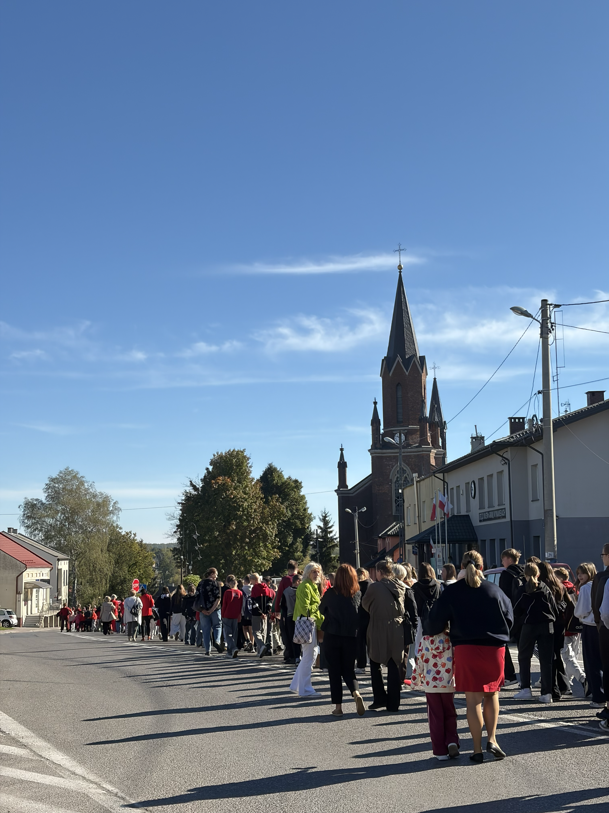
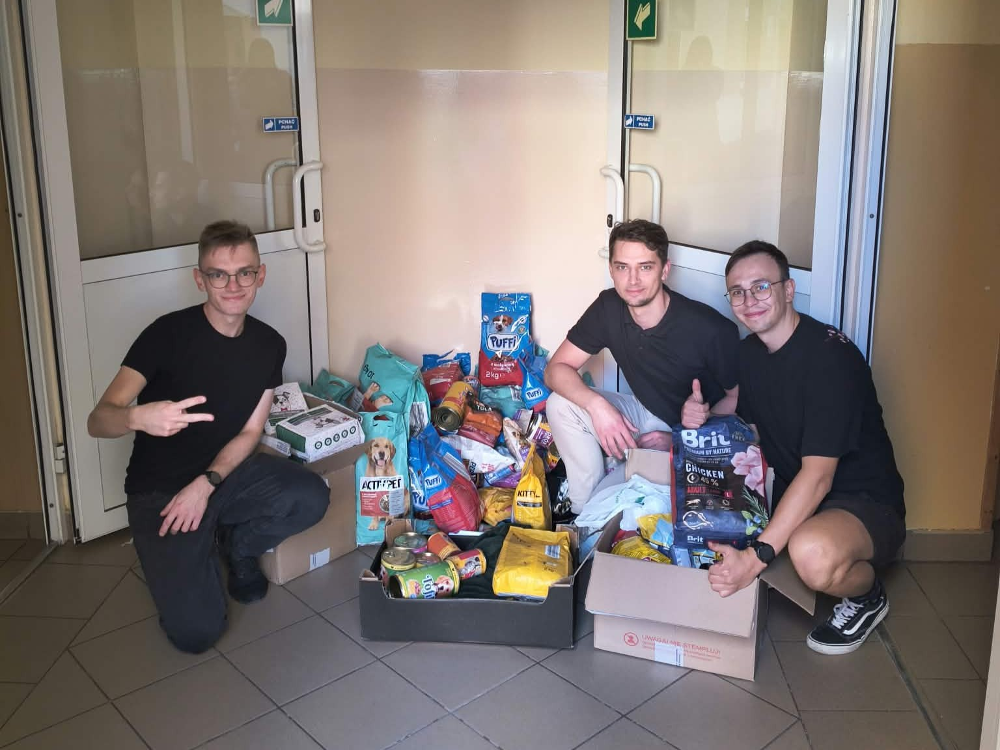
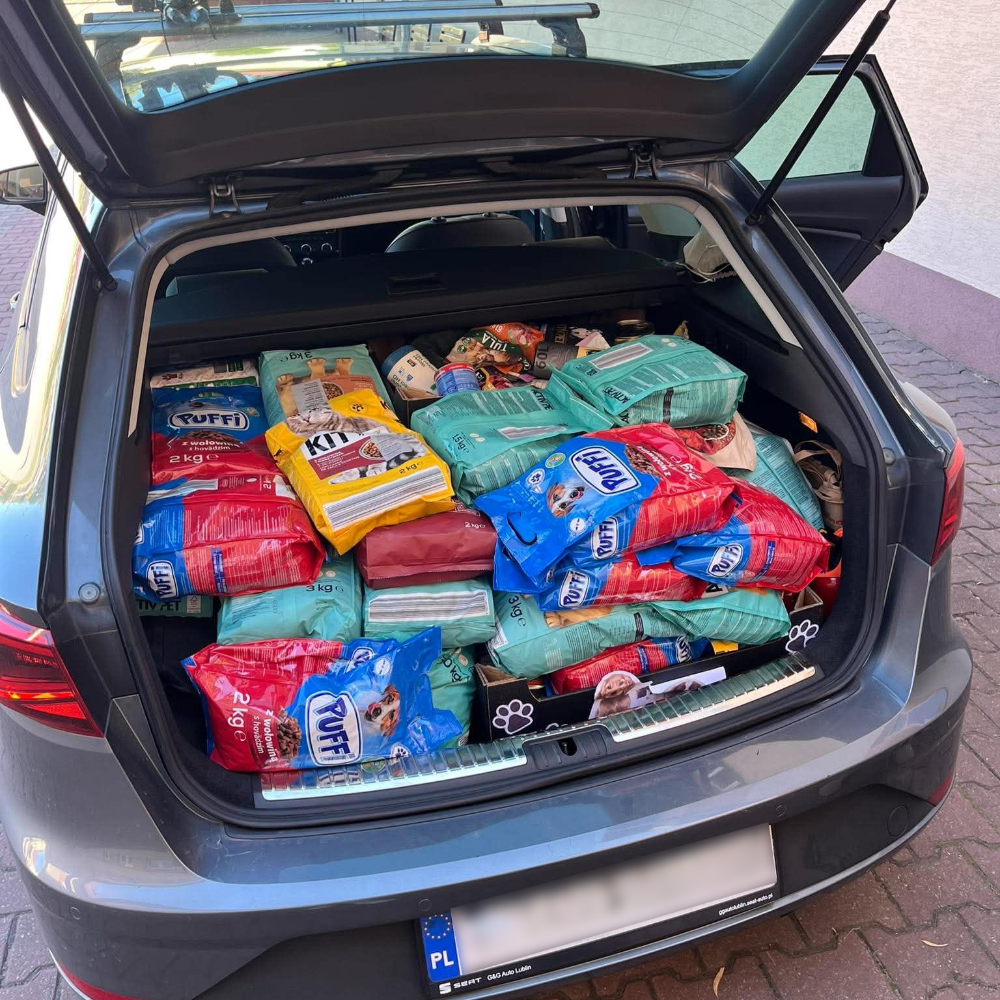
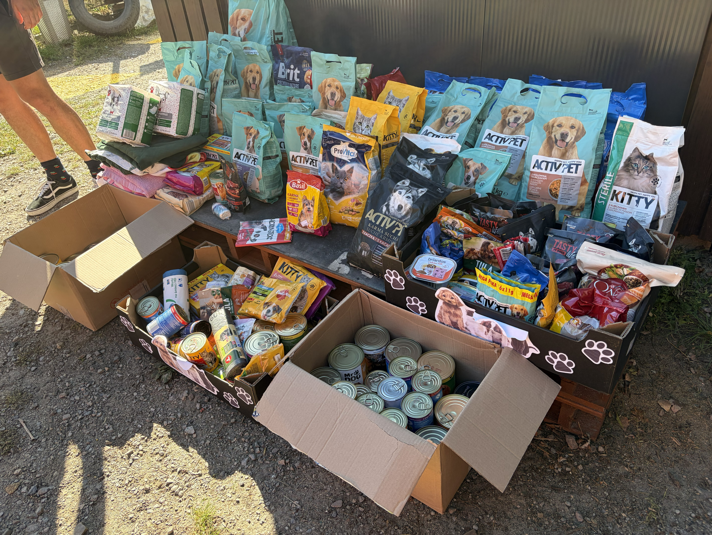

W piątek, 2 października 2026 roku, odwiedziliśmy Publiczną Szkołę Podstawową im. Marszałka Józefa Piłsudskiego w Iwaniskach, aby poprowadzić spotkanie edukacyjne dla uczniów. Była to dla nas wspaniała okazja, by podzielić się doświadczeniem zdobytym podczas tegorocznej edycji Rowerem z Sercem.

Chcieliśmy w przystępny sposób przypomnieć uczniom podstawowe zasady bezpiecznej jazdy, podpowiedzieć jak przygotować się na dłuższe wyprawy rowerowe oraz opowiedzieć o kulisach przygotowań do rajdu.

Wraz z zapowiedzią spotkania ogłosiliśmy zbiórkę artykułów dla Przytuliska na Wiśniowej w Sandomierzu.

## Przedpremierowy pokaz aftermovie

Na początku chcieliśmy przybliżyć wszystkim szczegóły naszej akcji, żeby każdy wiedział, o czym mówimy. Dlatego spotkanie rozpoczęliśmy od wspólnego obejrzenia krótkiego, 10-minutowego filmu. Całość zostanie niedługo opublikowana, ale uczniowie z Iwanisk mogli zobaczyć ją przedpremierowo. Film prezentował najważniejsze momenty z każdego dnia transmisji.

Na zakończenie zapytaliśmy uczniów, czy się podobał, i usłyszeliśmy głośne brawa, co było bardzo miłym momentem.

## Kilka słów o bezpieczeństwie

Po projekcji pałeczkę przejął Mariusz i przedstawił kilka podstawowych zasad bezpiecznej jazdy:

- Patrz przed siebie.
- Jedź przewidywalnie.
- Zachowaj odstęp.
- Korzystaj ze ścieżek rowerowych.
- Zatrzymuj się bezpiecznie.

Są one szczególnie ważne, gdy jedziemy w grupie. Mariusz pokazał też podstawowe znaki, którymi porozumiewamy się w trakcie jazdy.

Następnie ja opowiedziałem o podstawowym wyposażeniu roweru: lampkach, odblaskach, hamulcach itp. Zwróciłem też uwagę na jazdę w kasku, który od 3 czerwca tego roku jest obowiązkowy dla rowerzystów do 16. roku życia. Przywołaliśmy również słowa Jacka Kwiatkowskiego, [ultrakolarza z Torunia](https://www.centrumrowerowe.pl/blog/ultrakolarz-jacek-kwiatkowski-wywiad/): *„Kask to nie opcja, to podstawa"*.

Z kolei Michu podzielił się wiedzą z zakresu serwisowania roweru (przypomnijmy, że pracował jako serwisant rowerowy) i wyjaśnił, na co zwrócić uwagę, przygotowując rower do sezonu. Przede wszystkim starał się przekonać uczestników, że podstawowe czynności serwisowe nie są trudne i warto wykonywać je samodzielnie.

Michu podrzucił też kilka rad dotyczących planowania trasy, między innymi pokazał aplikacje, z których korzystaliśmy – szczególnie polecamy naszego rodzimego [Veloplannera](https://veloplanner.com/pl). Podzielił się też wskazówkami dotyczącymi bikepackingu na dłuższych trasach.

Na koniec opowiedzieliśmy o kulisach powstawania rajdu: naszych działaniach w mediach społecznościowych, współpracy z Urzędem Miasta Sandomierza i lokalnym Radiem Rekord oraz integrowaniu lokalnej społeczności.

Spotkanie zakończyliśmy krótkim quizem i sesją pytań, w której można było zdobyć drobne gadżety przekazane przez Urząd Miasta Sandomierz. Serdecznie dziękujemy Urzędowi oraz Panu Burmistrzowi Pawłowi Niedźwiedziowi – gadżety wzbudziły ogromne zainteresowanie wśród młodzieży.

## Happening z okazji Tygodnia Przeciwdziałania Przemocy Rówieśniczej

Po spotkaniu wzięliśmy udział w happeningu z okazji Tygodnia Przeciwdziałania Przemocy Rówieśniczej, który miał formę przemarszu ulicami Iwanisk. Przejście zabezpieczała Policja, a my razem z uczniami dołączyliśmy do wydarzenia.

## Zbiórka dla Przytuliska na Wiśniowej

Jak wspomnieliśmy na początku, równolegle z ogłoszeniem spotkania w szkole była prowadzona zbiórka dla Przytuliska na Wiśniowej. Byliśmy pod ogromnym wrażeniem, ile artykułów udało się zebrać w zaledwie 4 dni, które minęły od ogłoszenia do naszego przyjazdu. Serdecznie dziękujemy wszystkim uczniom, którzy przekazali dla Przytuliska potrzebne rzeczy.

Zebrane przez uczniów artykuły zawieźliśmy do schroniska osobiście. Bardzo dziękujemy Pani Iwonie za oprowadzenie nas po Przytulisku i opowiedzenie o jego mieszkańcach. To była świetna okazja, by poznać to miejsce od środka. Uwierzcie nam na słowo: panuje tam atmosfera pełna miłości, a psiaki są dobrze zaopiekowane. Wolontariusze dokładają wszelkich starań, by regularnie wychodziły na spacery, i poświęcają im mnóstwo uwagi. Jeśli myślicie o adopcji psa, koniecznie pamiętajcie o [Przytulisku](https://www.facebook.com/Przytulisko.na.Wisniowej).

## Nasze wrażenia

Spotkanie było dla nas bardzo miłym doświadczeniem. Nigdy wcześniej nie występowaliśmy w szkole, więc nie wiedzieliśmy, czego się spodziewać. Szczególnie wzruszyło nas, jak ciepło zostaliśmy przyjęci wraz z naszą inicjatywą. Byliśmy też zaskoczeni aktywnością uczniów i tym, jak ciekawe pytania zadawali.

Jeśli nie zdążyliśmy odpowiedzieć na któreś z Waszych pytań, przepraszamy – piszcie śmiało na naszych socialach, a postaramy się odpowiedzieć.

Jeszcze raz dziekujemy za wspólnie spędzony czas. Szczególnie dziękujemy też [Klaudii Grześkiewicz](https://www.instagram.com/claudiaarchive/), która wyszła z inicjatywą organizacji wydarzenia.